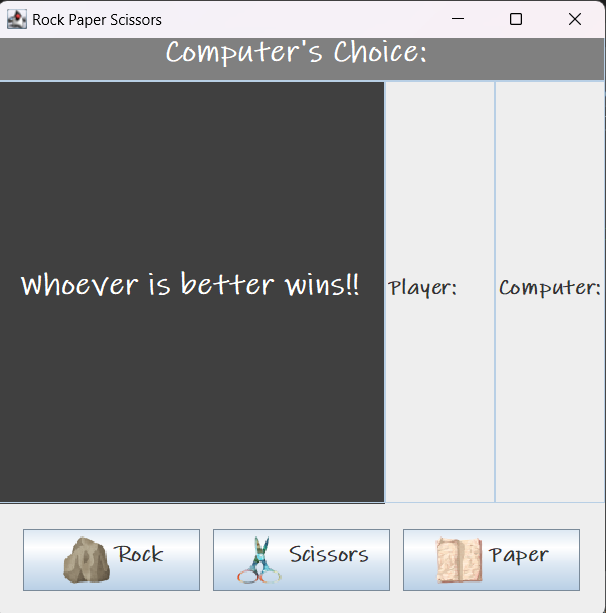

# Rock-Paper-Scissors GUI
This is a simple Rock Paper Scissors game where a player competes against the  computer.

## Features:
-Playable by one player (player vs computer).

-Interactive and user-friendly GUI built with Java Swing.

-Displays results of each round,determines the win  depending  on who reaches ***score: 3*** first.

## How To Run:
1.Clone the repository: `git clone` <https://github.com/Alcom01/RockPaperScissorsGUI.git>

2.Open an IDE of your liking(Eclipse, IntelliJ, VS Code).

3.Compile and run the  `Main` Class.

## Tools Used:
- Java Swing(Graphical User Interface).
  
- Java (Logic & Core Programming).

## Screenshots:

